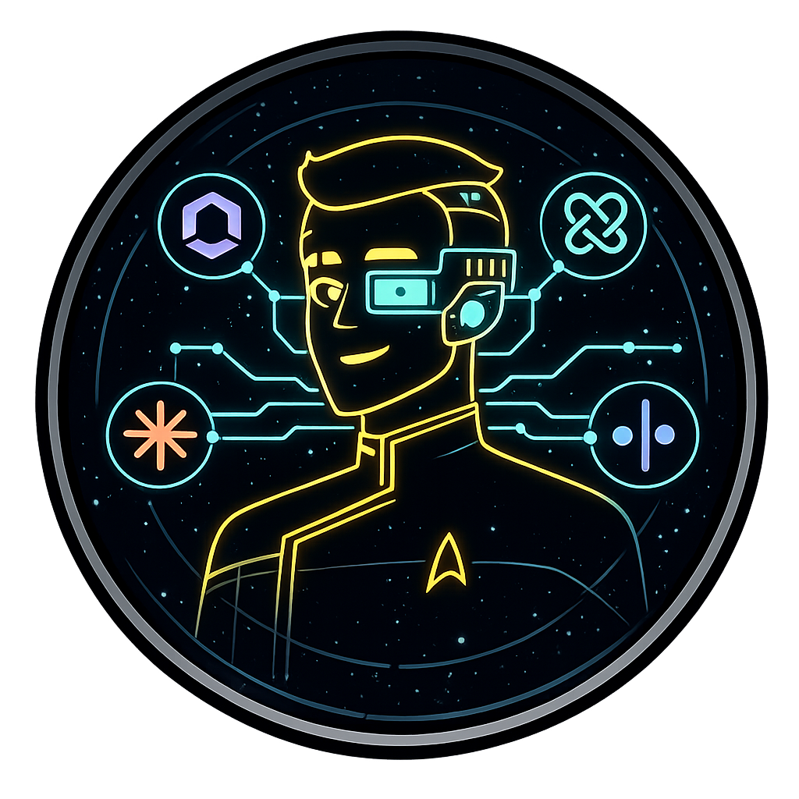

<p align="center">
  
</p>

<h1 align="center">Rutherford — Kiro Crew App &nbsp;|&nbsp; <a href="https://github.com/chapmanjw/rutherford-mcp-server">MCP Server</a></h1>

<p align="center"><b>Give your AI coding agent a crew — as a Kiro Crew app.</b></p>

<p align="center">
A <a href="https://kiro.dev/docs/crew/apps/build-first-app/">Kiro Crew app</a> that registers the Rutherford MCP server,
installs the Rutherford skills, and ships the <code>rutherford-orchestrator</code> agent to set up, configure,
and drive a crew of coding agents — Claude Code, Codex, Cursor, Goose, and more — over the
<a href="https://agentclientprotocol.com">Agent Client Protocol</a>.<br>
Hand work to one agent, ask several in parallel, or have them argue it out.
</p>

<p align="center">
  <a href="https://pypi.org/project/rutherford-mcp-server/"></a>
  <a href="LICENSE"></a>
</p>

> **This repo is the Kiro Crew port of the [Rutherford Claude plugin](https://github.com/chapmanjw/rutherford-claude-plugin).**
> Because GitHub does not allow a single account to own both a repo and a fork of it, this is not a GitHub
> "forked from" repo — instead it descends from the plugin's git history and tracks it as the `upstream`
> remote, so `git diff upstream/main` and `git pull upstream main` work as they would on a fork.

---

## Install into Kiro Crew

**Prerequisite:** [uv](https://docs.astral.sh/uv/) on your PATH — the app launches the MCP server with `uvx`.

This repo doubles as its own external registry: its root holds an [`app-registry.json`](app-registry.json)
index that lists this app. So you can add the repo as a registry and install Rutherford one-click from the
**App Store** — no clone required. (The manual `git clone` + `kirocrew app install <path>` route still
works and is documented below as the contributor path.)

### App Store install (recommended)

1. **Add this repo as a registry.** In the dashboard, go to **Settings → Apps → Registries → Add** and
   enter:

   | Field | Value |
   | --- | --- |
   | Name | `Rutherford` |
   | Repo | `https://github.com/chapmanjw/rutherford-kiro-crew-app` |
   | Branch | `main` |
   | Trust | `index` |

   Or add it to the `registries` list in `~/.kiro/crew/config.json`:

   ```json
   {
     "registries": [
       {
         "name": "Rutherford",
         "repo": "https://github.com/chapmanjw/rutherford-kiro-crew-app",
         "branch": "main",
         "trust": "index"
       }
     ]
   }
   ```

   Kiro Crew reads the repo's `app-registry.json`, and **Rutherford** appears in the App Store.

2. **Install** Rutherford from the App Store (**Browse → Rutherford → Install**). Kiro Crew clones this
   repo and reads `app.json` from its root.

3. **Grant trust.** Rutherford is a third-party app; Kiro Crew gates its agent and MCP server behind an
   explicit trust grant, so until you grant it, `enable` registers nothing executable — no
   `rutherford-orchestrator` agent and no `rutherford` MCP server. Grant it in the dashboard consent
   prompt, or add `"rutherford"` to `agent.apps_trusted` in `~/.kiro/crew/config.json`:

   ```json
   {
     "agent": {
       "apps_trusted": ["rutherford"]
     }
   }
   ```

   (Third-party apps are disabled by default; the master toggle is under **Settings → Security**.)
   Uninstalling the app clears the grant.

4. **Enable** the app (the App Store's Enable button, or `kirocrew app enable rutherford`).

> **Note:** `agent.apps_allow_third_party = true` trusts every present and future third-party app, not
> just Rutherford — prefer the app-scoped grant above unless you deliberately want to trust all apps.

> **Trust tier:** use `trust: "index"` (the default and recommended posture). The registry's index is
> treated as untrusted content, so each listed app clones credential-free — which is exactly right for a
> public repo. `trust: "owner"` is only meaningful for an edition-pinned registry under your own change
> control and is not needed here.

### Local install from a checkout (contributor path)

You can also install directly from a local checkout — the path contributors use when iterating on the app
before pushing:

1. **Clone and install** from the checkout:

   ```bash
   git clone https://github.com/chapmanjw/rutherford-kiro-crew-app
   kirocrew app install ./rutherford-kiro-crew-app
   ```

   (In the dashboard, use the equivalent install-from-path / install-from-source action pointed at the
   checkout.)

2. **Grant trust** and **enable** exactly as in steps 3–4 above.

With trust granted, enabling (via either path) registers the Rutherford MCP server (via
`uvx rutherford-mcp-server`), installs the Rutherford skills into `~/.kiro/crew/skills/rutherford/`, and
makes the `rutherford-orchestrator` agent available in the dashboard agent selector and as a subagent.

Select **rutherford-orchestrator** from the agent dropdown to run a whole session as the crew router: Sam
health-checks the crew with `doctor` and routes each request to the right mode (`delegate`, `consensus`,
`debate`, `review`, or `plan`).

Editing a skill takes effect after the app reloads; manifest, agent, and MCP changes need a re-enable
(`kirocrew app disable rutherford` then `kirocrew app enable rutherford`).

### Hosting your own registry that also lists other apps (advanced)

This repo already **is** a valid registry that lists itself (see [`app-registry.json`](app-registry.json)
at the root), so you do not need to host anything to install Rutherford — the App Store path above is the
supported one. But if you want a single team registry that lists Rutherford **alongside your own apps**,
host a git repo whose root contains an `app-registry.json` index. That file is a JSON array of entries,
each pointing at an app repo (the required fields are `name` plus a clone URL in `gitUrl`, with `repo`
accepted as a legacy alias; `branch` is optional and defaults to `main`; `subdirectory` is optional and
defaults to the repo root, so omit it when the app's `app.json` is at the repo root):

```json
[
  { "name": "rutherford", "gitUrl": "https://github.com/chapmanjw/rutherford-kiro-crew-app", "branch": "main" },
  { "name": "your-app", "gitUrl": "https://github.com/your-team/your-app", "branch": "main" }
]
```

Users opt in by adding your registry repo to the `registries` list in `~/.kiro/crew/config.json` (or via
**Settings → Apps → Registries**):

```json
{
  "registries": [
    { "name": "my-team", "repo": "https://github.com/my-team/my-kirocrew-registry", "branch": "main", "trust": "index" }
  ]
}
```

The `repo` here is the **registry** repo — the one holding `app-registry.json`. For a separate team
registry that is a different repo from the apps it lists; for this project the registry repo and the app
repo are the same repo, because its `app-registry.json` lists itself. Kiro Crew reads the index, and each
listed app installs one-click with a trust grant. See the
[Federated external registries](https://kiro.dev/docs/crew/apps/#federated-external-registries) docs.

## What this app is

Rutherford gives your coding agent a crew. This is the Kiro Crew-facing package: it registers the
[Rutherford MCP server](https://github.com/chapmanjw/rutherford-mcp-server) — a stdio server that speaks
the [Agent Client Protocol](https://agentclientprotocol.com) to each coding agent — and adds the skills
and an orchestrator agent that drive it.

From inside Kiro Crew you hand one task to one agent, ask several the same question in parallel, have them
argue across rounds, or run a multi-model code review, using agents you already log into. Rutherford reuses
each agent's own login and never calls a model provider's API.

The app launches the server with the pinned `uvx rutherford-mcp-server@3.2.0`, which fetches it from PyPI
on first run and caches it, so there is no separate install step (you do need `uv` on your PATH, since
`uvx` ships with it). You can install the server yourself with `uv tool install rutherford-mcp-server`
(or `pipx install rutherford-mcp-server`), but a PATH-installed binary is **not** used automatically: the
manifest always runs the pinned `uvx` invocation. To use your own install, edit `app.json`'s
`mcpServers.rutherford` command. The `setup-rutherford` skill covers that path.

## What's inside

### Skills

Setup and configuration:

| Skill | What it does |
| --- | --- |
| `setup-rutherford` | Verify the connection, run `doctor`, scaffold `config.toml`, install missing ACP adapters. |
| `configure-panels` | Define reusable crews (panels) in `panels.toon`, then hot-reload them. |
| `configure-defaults` | Set `config.toml` defaults: safety posture, trusted workspaces, effort, persistence. |
| `configure-roles` | Author custom role personas, with the server-restart caveat. |
| `add-agents` | Discover installed ACP agents, adopt a local model, or define an agent by hand. |
| `configure-permissions` | Allowlist the Rutherford tools and `.rutherford` directories so they stop prompting. |
| `troubleshoot-connection` | Diagnose why an agent will not drive, from `doctor` states to fixes. |

Driving the crew:

| Skill | What it does |
| --- | --- |
| `delegate-task` | Hand one task to one agent (read-only by default). |
| `multi-agent-consensus` | Ask several agents the same question in parallel; compare or vote. |
| `agent-debate` | A multi-round debate where agents see each other's positions and revise. |
| `code-review-panel` | Review a diff or changed files across agents at a senior/principal bar. |
| `background-jobs` | Run long work as a background job; manage and persist it. |
| `safe-write-delegation` | Let an agent edit code, behind the trusted-workspace gate and a sandbox. |

### Agent

`rutherford-orchestrator` — health-checks the crew with `doctor`, then routes a request to the right mode:
`delegate`, `consensus`, `debate`, `review`, or `plan`. The seven original slash commands
(`setup`, `doctor`, `panels`, `permissions`, `consensus`, `debate`, `review`) are folded into this agent's
routing — ask for the mode in plain language and it runs it. Select it from the dashboard agent selector,
or invoke it as a subagent from any session.

### MCP server

The app declares the Rutherford MCP server in its manifest, launched as `uvx rutherford-mcp-server`. It
exposes 18 tools and 19 built-in agents.

```
Kiro Crew
   |  MCP over stdio
rutherford-mcp-server          (the ACP client)
   |  ACP over stdio, one session per voice
   +--> claude-agent-acp, codex-acp, goose acp, cursor-agent acp, ... 19 built-in agents
```

## Safety

Everything defaults to read-only. The `write` and `yolo` modes are explicit opt-in behind a
trusted-workspace gate, and the deliberation tools (`consensus`, `debate`, `review`, `plan`) never write.
See [`reference/safety.md`](reference/safety.md) and the `safe-write-delegation` skill.

## Documentation

The app bundles reference docs that the skills cite:
[tools](reference/tools.md), [safety](reference/safety.md), [panels](reference/panels.md),
[config](reference/config.md), [permissions](reference/permissions.md), and
[persona](reference/persona.md). For the full server reference, see the
[rutherford-mcp-server docs](https://github.com/chapmanjw/rutherford-mcp-server#documentation).

## Relationship to the Claude plugin

This app is a straight port of the [Rutherford Claude plugin](https://github.com/chapmanjw/rutherford-claude-plugin).
The plugin lives in its own repo and is tracked here as the `upstream` remote; no copies of its
Claude-specific files are kept in this repo. The live Kiro Crew surface is defined by `app.json`, the
converted `agents/*.json`, and the `skills/` directory. Track upstream changes with:

```bash
git remote -v            # upstream -> rutherford-claude-plugin
git fetch upstream
git diff upstream/main
```

## The name

```
.---------.
|  \/\/\/ |
|  O  [==]|
|    <    |
|  \___/  |
'---------'
-- Ensign Sam Rutherford --
USS Cerritos . Engineering
```

> Named for the cheerful engineer aboard the USS Cerritos in *Star Trek: Lower Decks*, who has a gift for
> getting heterogeneous systems to cooperate. *Star Trek* and *Lower Decks* are trademarks of their
> respective owners; this is an unaffiliated, fan-named open-source project.

## Versioning and publishing

The app's version lives in [`app.json`](app.json) as a semver `version`, validated by Kiro Crew's app
manifest. There is no marketplace manifest for the Kiro Crew surface. This repo distributes in two ways
off the same source: it doubles as its own **external registry** — its root [`app-registry.json`](app-registry.json)
lists this app, so users can add the repo as a registry and install one-click from the App Store — and it
also installs directly **from a local checkout** (`kirocrew app install`) for contributors iterating before
they push.

To cut a release: bump `version` in `app.json`, add a dated `## [X.Y.Z]` entry to
[`CHANGELOG.md`](CHANGELOG.md), commit, then tag `vX.Y.Z` and push the tag. `app.json` is the sole
version source of truth, and `scripts/validate-app.mjs` validates it — and the `app-registry.json` index —
on every push. Because the registry index points at `branch: main`, an App Store install always tracks the
tip of `main`; the tag is the human-readable release marker.

Coming from the Claude plugin: it versioned through its own manifest and installed with a Claude Code
plugin command; the Kiro Crew app versions through `app.json` and installs with `kirocrew app install`.

## Contributing

See [CONTRIBUTING.md](CONTRIBUTING.md), [CHANGELOG.md](CHANGELOG.md), and [SECURITY.md](SECURITY.md).

## License

MIT — see [LICENSE](LICENSE).
